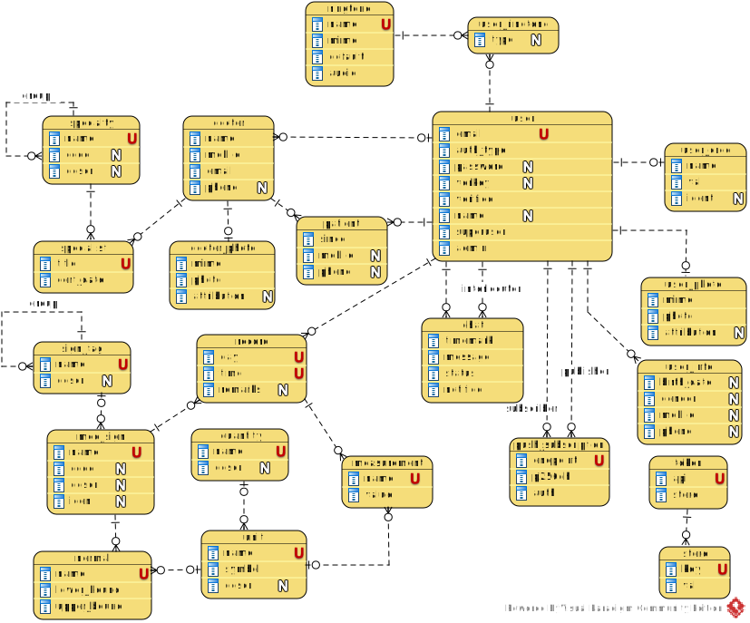

[In english](https://github.com/ciukstar/medcab/blob/master/README.md)  

[În română](https://github.com/ciukstar/medcab/blob/master/README.ro.md)  

[На русском](https://github.com/ciukstar/medcab/blob/master/README.ru.md)  

## MedCab
Application Web de soins de santé

## Aperçu
L'application [MedCab](https://medcabfr-jjgwe5ufda-de.a.run.app) offre la possibilité d'enregistrer et de suivre les signes vitaux, de voir leur dynamique au fil du temps et de les comparer aux valeurs normales.


## Consultation médecin-patient en ligne
Si nécessaire, le patient peut choisir un médecin à consulter en échangeant des messages (chat avec le médecin) ou par appel vidéo/audio.

Le chat avec un médecin est implémenté à l'aide du protocole [WebSockets](https://developer.mozilla.org/fr/docs/Web/API/WebSockets_API).

L'appel vidéo/audio avec le médecin est implémenté à l'aide de [l'API WebRTC](https://developer.mozilla.org/fr/docs/Web/API/WebRTC_API).

* Configuration
  * ```$YESOD_RTC_PEER_CONNECTION_CONFIG```
  
Pour les notifications, [l'API Web Push](https://developer.mozilla.org/fr/docs/Web/API/Push_API) est utilisée.

## Entités de base

### Utilisateur

Un nouvel utilisateur peut s'inscrire en utilisant un compte Google ou en créant un nouveau compte sur la [page d'authentification](https://medcabfr-jjgwe5ufda-de.a.run.app/auth/login).

Pour créer un nouveau compte, il est nécessaire de fournir une adresse email. L'adresse e-mail sera utilisée pour vérifier le compte et pour définir ou récupérer le mot de passe.

Un superutilisateur (voir ci-dessous) peut accorder des privilèges d'administrateur à tout utilisateur enregistré. Un utilisateur doté du rôle d'administrateur peut à son tour accorder ou révoquer le rôle d'administrateur à d'autres utilisateurs enregistrés. Des privilèges d'administrateur sont requis pour gérer les données à l'échelle du système.

### Unité de mesure

Une unité de mesure est définie en fournissant un nom, un symbole et une description dans la section [« Unités de mesure »](https://medcabfr-jjgwe5ufda-de.a.run.app/data/units).

### Médecin

...

### Spécialité

...

## Superutilisateur

* Nom d'utilisateur  
  ```$YESOD_SUPERUSER_USERNAME```
* Mot de passe  
  ```$YESOD_SUPERUSER_PASSWORD```
  
Un compte superutilisateur est défini au moment du déploiement. Le superutilisateur gère les autres utilisateurs et accorde ou révoque les privilèges d'administrateur à des utilisateurs spécifiques.

## Intégration avec des API externes

* Email: [Gmail API](https://developers.google.com/gmail/api/guides)  

  * Identifiant client  
    ```$YESOD_GOOGLE_CLIENT_ID```
  * Secret client  
    ```$YESOD_GOOGLE_CLIENT_SECRET```

## Optimisation du moteur de recherche

* [Google SEO](https://search.google.com/search-console)

  ```$YESOD_GOOGLE_SITE_VERIFICATION```
  
* [Bing SEO](https://www.bing.com/webmasters)

  ```$YESOD_MS_VALIDATE```
  
* [Yandex SEO](https://webmaster.yandex.com/welcome)

  ```$YESOD_YANDEX_VERIFICATION```

## Diagramme ER



## Démo

[Cliquez ici pour voir la démo](https://medcabfr-jjgwe5ufda-de.a.run.app)

_* Cliquez sur le bouton [](https://medcabfr-jjgwe5ufda-de.a.run.app/auth/login) pour obtenir une liste des comptes d'utilisateurs de démonstration_
