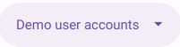

## App MedCab

[This application](https://medcab-jjgwe5ufda-de.a.run.app) is under development...


## Doctor and patient chat

... using [WebSocket](https://developer.mozilla.org/en-US/docs/Web/API/WebSockets_API)

## Patient/Doctor Video Call

... using [WebRTC](https://developer.mozilla.org/en-US/docs/Web/API/WebRTC_API)

## Basic Entities

### User

A new user can sign up using a Google account or by creating a new account on the [authentication page](https://medcab-jjgwe5ufda-de.a.run.app/auth/login).

To create a new account, it is necessary to provide an email address. The email address will be used to verify the account and to set or recover the password.

A superuser (see below) can grant administrator privileges to any registered user. A user with the administrator role can in turn grant or revoke the administrator role to other registered users. Administrator privileges are required to manage system-wide data.

### Unit of measurement

A unit of measurement is defined by providing a name, symbol, and description in the section [“Measurement units”](https://medcab-jjgwe5ufda-de.a.run.app/data/units).

### Doctor

...

### Specialty

...

## Superuser

* Username  
  ```$YESOD_SUPERUSER_USERNAME```
* Password  
  ```$YESOD_SUPERUSER_PASSWORD```
  
A superuser account is defined at deployment time. The superuser manages other users and grants or revokes administrator privileges to specific users.

## Integration with external APIs

* Email: [Gmail API](https://developers.google.com/gmail/api/guides)  

  * Client id  
    ```$YESOD_GOOGLE_CLIENT_ID```
  * Client secret  
    ```$YESOD_GOOGLE_CLIENT_SECRET```

## Search Engine Optimization

* [Google SEO](https://search.google.com/search-console)

  ```$YESOD_GOOGLE_SITE_VERIFICATION```
  
* [Bing SEO](https://www.bing.com/webmasters)

  ```$YESOD_MS_VALIDATE```

## ER Diagram


## Demo

[Click here to see demo](https://medcab-jjgwe5ufda-de.a.run.app)

_* Click on the [](https://medcab-jjgwe5ufda-de.a.run.app/auth/login) button to get a list of demo accounts_
